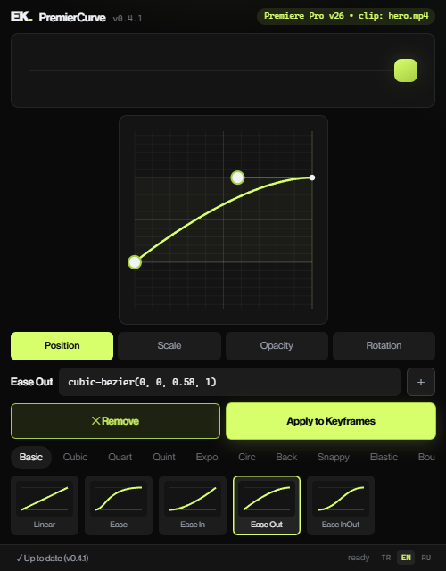
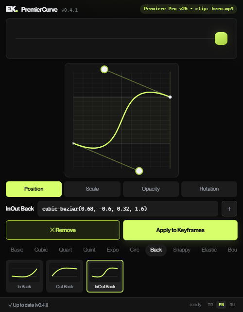
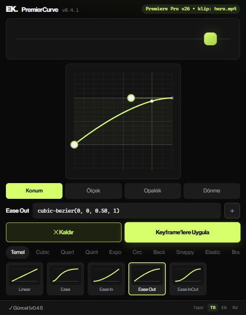
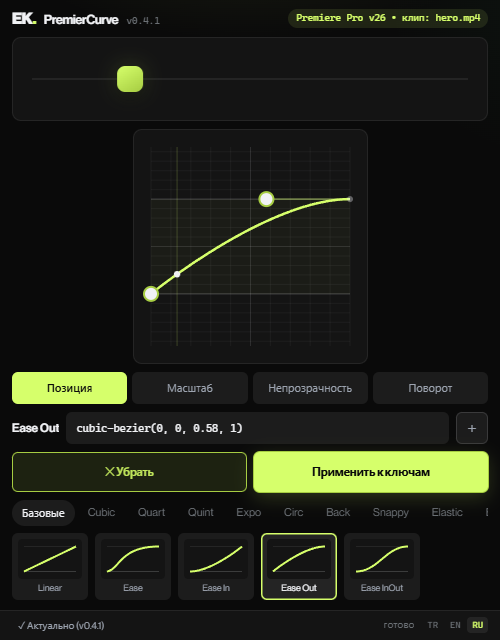

<div align="center">


# PremierCurve

**English** · [Türkçe](README.tr.md)

**Easing & bezier curve editor for Adobe Premiere Pro** — the graph editor Premiere never shipped.

[](https://emrekazak.com/api/version.php?product=premiercurve)
[](#requirements)
[](#install)
[](#trilingual-ui)
[](LICENSE)
[](https://emrekazak.com/premiercurve.php)

[**⬇ Download**](https://emrekazak.com/premiercurve.php#indir) · [Product page](https://emrekazak.com/premiercurve.php) · [Report a bug](https://github.com/ScamEmre/premiercurve/issues)



</div>

---

## Why

In Premiere Pro, easing a keyframe means right-clicking and picking *Ease In / Ease Out* — the same fixed smoothing every time. There is **no graph editor and no cubic-bezier input**; the tool After Effects users take for granted simply doesn't exist for Premiere keyframes.

PremierCurve adds it as a dockable panel:

- **31 curated presets** across 10 families — Ease, Cubic, Quart, Quint, Expo, Circ, Back, Snappy, **Elastic**, **Bounce**
- **Draw your own curve** on a square graph-paper editor — drag the two control points or paste any `cubic-bezier(…)` value
- **Live motion preview** — a real animated object in 4 modes (Position / Scale / Opacity / Rotation), driven by the *exact same* `ease(t)` that gets applied → WYSIWYG
- **Save custom curves** and reuse them as presets
- **One-click Remove** — strips an applied ease back to the 2 anchor keyframes
- **Built-in update check** — the footer tells you when a new version ships

<div align="center">

<br/><sub>Editing an overshoot curve — drag the handles or type the cubic-bezier value.</sub>
</div>

## Trilingual UI

The panel speaks **Türkçe, English and Русский**. It auto-matches Premiere's UI language on first launch; switch any time with the `TR · EN · RU` buttons in the footer.

<div align="center">
&nbsp;&nbsp;

</div>

Since **v0.4.1**, property targeting is fully **locale-independent**: clips are inspected via `Component.matchName` + parameter index instead of display names, so *Scale* is found correctly even when the host calls it *Skalieren* (German), *Échelle* (French) or anything else.

## Requirements

| | |
|---|---|
| **Host** | Adobe Premiere Pro 2024 or newer (2025 / 2026 recommended) |
| **OS** | Windows · macOS |
| **Engine** | CEP · ExtendScript (no install wizard, no services, no telemetry) |

## Install

> **Fastest path:** grab the ready-to-use ZIP from the [download page](https://emrekazak.com/premiercurve.php#indir) — it includes a step-by-step `KURULUM.txt` in three languages. Installing from this repo works the same way (note: the repo ships **without** the commercial NHG font files, so the panel falls back to your system font; the official ZIP is fully styled).

**1 — Allow unsigned extensions** *(once — PlayerDebugMode)*

Windows — in `regedit`, create a String (`REG_SZ`) value `PlayerDebugMode = 1` under each of:

```
HKEY_CURRENT_USER\Software\Adobe\CSXS.11
HKEY_CURRENT_USER\Software\Adobe\CSXS.12
```

macOS — in Terminal:

```bash
defaults write com.adobe.CSXS.11 PlayerDebugMode 1
defaults write com.adobe.CSXS.12 PlayerDebugMode 1
```

**2 — Copy the extension folder**

Copy the panel (this repo, or the `com.emrekazak.premiercurve.cep` folder from the ZIP) to:

```
Windows:  %APPDATA%\Adobe\CEP\extensions\com.emrekazak.premiercurve.cep\
macOS:    ~/Library/Application Support/Adobe/CEP/extensions/com.emrekazak.premiercurve.cep/
```

**3 — Restart Premiere** → `Window ▸ Extensions ▸ PremierCurve` *(on 2025/2026 it may live under `Window ▸ Extensions (Legacy)`)*.

## Usage

1. In the timeline, select a clip that has **at least 2 keyframes** on a property (e.g. *Effect Controls ▸ Motion ▸ Position*).
2. Put the **playhead between the two keyframes** you want to ease — that's how the target segment is chosen (Premiere exposes no keyframe-selection API).
3. Pick the target property with the **Position / Scale / Opacity / Rotation** buttons — they drive both the live preview *and* what Apply writes to.
4. Click a preset or draw your own curve, then hit **Apply to Keyframes**. The status bar echoes exactly what was written, e.g. `Motion › Scale • 4.0–4.7s • 29 kf`.
5. **✕ Remove** cleans the segment back to its 2 anchors in one click. Applying a different curve replaces the previous one automatically.

> **Tip:** the ease is *baked* as intermediate keyframes, so `Ctrl+Z` undoes them one by one — use **✕ Remove** instead.

## How it works

Premiere's ExtendScript API can't write real temporal-ease handles (that's a UXP-only capability marketed as *True Handles* elsewhere). PremierCurve instead **bakes**: it samples the easing function and writes ~30 intermediate keyframes between your two anchors. The trade-off is a denser keyframe track — the win is that the motion is *exact*, and families no single cubic-bezier can express (**Elastic**, **Bounce**) become possible.

Other engineering notes:

- **Playhead → segment mapping** converts sequence time into the clip/source time reference `getKeys()` uses, trying several candidates so trimmed/moved clips and source timecode don't break targeting.
- **Locale-free host protocol** — the ExtendScript side returns message codes (`E_NO_CLIP`, `BAKED|…`), and the panel renders them in the active UI language.
- **Update check** pings `emrekazak.com/api/version.php` on launch (4s timeout, fails silent, no tracking).

## Development

No build step — plain HTML/CSS/JS + ExtendScript.

```bash
git clone https://github.com/ScamEmre/premiercurve.git
```

- **Design-time preview:** open `index.html` in Chrome — the full UI runs in "browser preview" mode (Apply is disabled without a host).
- **Live debug inside Premiere:** the panel exposes Chrome DevTools at `http://localhost:8560` (see `.debug`).

<details>
<summary><b>Project structure</b></summary>

```
premiercurve-cep/
├─ CSXS/manifest.xml      host=PPRO, panel geometry, loads jsx/host.jsx
├─ .debug                 remote-debug port 8560
├─ index.html             panel entry
├─ css/style.css          carbon-black + phosphor UI
├─ js/
│  ├─ lib/CSInterface.js  minimal CEP bridge (+ browser fallback)
│  ├─ i18n.js             TR/EN/RU dictionary + language switcher
│  ├─ bezier.js           easing math (cubic-bezier solver + Penner fns)
│  ├─ presets.js          curated preset data
│  ├─ preview.js          shared-rAF live preview engine
│  ├─ editor.js           draggable graph-paper curve editor
│  └─ main.js             controller (gallery/tabs/apply/i18n/update)
├─ jsx/host.jsx           ExtendScript bake engine (locale-free message codes)
└─ docs/                  screenshots
```

</details>

## Changelog

| Version | Date | Highlights |
|---|---|---|
| **0.4.1** | 2026-09-18 | Locale-independent property targeting (`matchName` + param index); mode buttons now select the Apply/Remove target |
| **0.4** | 2026-09-09 | Trilingual UI (TR / EN / RU) with auto-detection; locale-free host protocol |
| **0.3** | 2026-09-03 | Editor-centric single-screen UI; every preset editable; playhead-segment targeting; update check |
| **0.2** | 2026-09-02 | First public build — preset gallery, live preview, bake engine |

## Roadmap

- ZXP signing → one-click install (no PlayerDebugMode)
- Parameter picker for effect properties beyond Motion/Opacity
- UXP build sharing the same UI (CEP is deprecated long-term)

## Credits & License

[MIT](LICENSE) © [Emre Kazak](https://emrekazak.com). Clean-room implementation: the bake approach was studied conceptually from [OpenCurve](https://github.com/fayewave/OpenCurve) and the preset-gallery/live-preview UX inspired by Eaze — **no third-party code was reused**. Neue Haas Grotesk is a commercial typeface and is not distributed in this repository.
